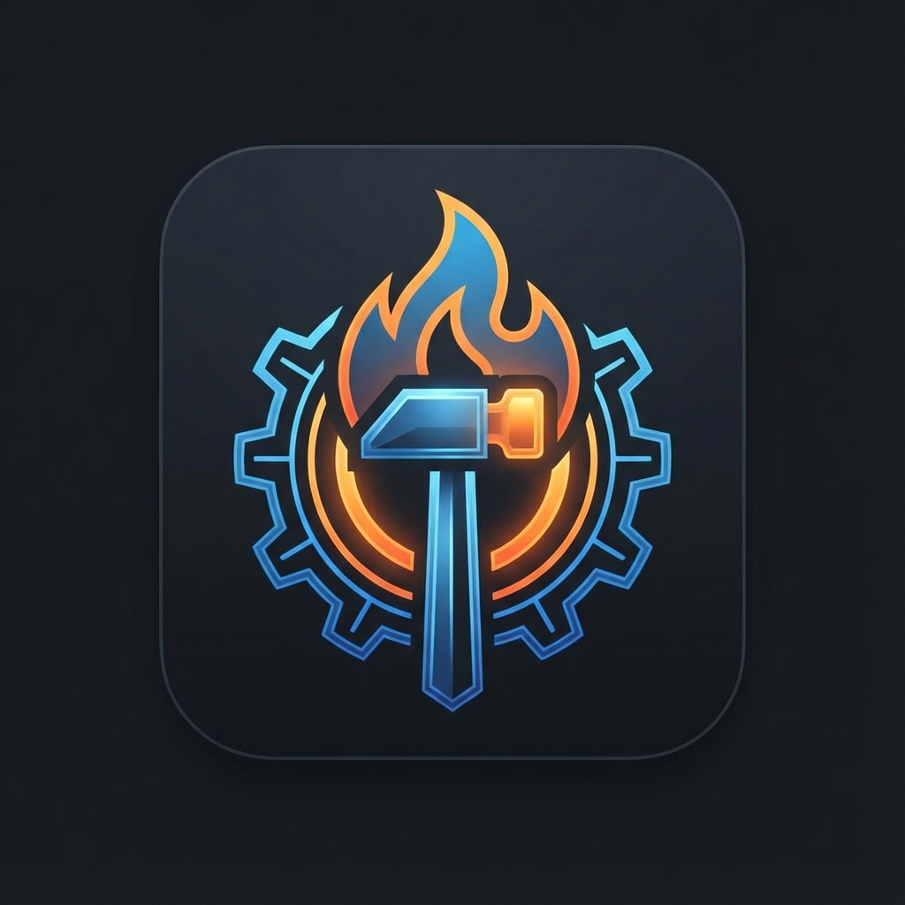

# awelauncher



[](VERSION)
[](LICENSE)
[](https://wayland.freedesktop.org/)
[](https://www.qt.io/)
[](https://isocpp.org/)
[](flake.nix)

> **Run in awe!** 🚀
>
> A fast, minimal Wayland launcher built with Qt6 and QtQuick.
>
> A system engineer’s launcher.

## Features

- **Fuzzy search** with visual match highlighting
- **Multiple modes**: 
  - Desktop apps (`drun`)
  - Command runner (`run`)
  - Window switcher (`window`) - Wayland window management
  - **Process Manager** (`top`, `kill`) - *New in 0.4.0*
  - **SSH Launcher** (`ssh`) - *New in 0.4.0*
- **Provider Sets**: Create custom workflows (e.g., `--set dev`) combining specific providers and filters.
- **Visual Polish**: Context icons, empty state overlays, and smart fallbacks.
- **Window controls**: Switch, close, fullscreen, maximize, minimize, move to monitor
- **Dmenu compliance**: Scriptable input/output mode (-d)
- **MRU boost**: Recently used apps/windows appear higher in results
- **Icon caching**: Async loading with disk cache for instant startup
- **Theming**: YAML-based themes + base16 system theme support
- **Performance**: 76ms cold start, < 16ms search updates
- **Wayland-first**: Native Wayland support with Qt6

## Building

### With Nix (recommended)

```bash
nix develop
cd build
cmake ..
make
```

### Manual build

Requirements:
- Qt6 (Quick, Gui, WaylandClient)
- yaml-cpp
- CMake 3.16+
- C++20 compiler

```bash
mkdir build && cd build
cmake ..
make
```

## Branding

The project logo is available in multiple sizes in the [`assets/`](assets/) directory, ranging from 16x16 to 512x512 pixels, for use in various system integrations.


```bash
# From build directory
sudo make install

# Or with Nix
nix build
```

## Configuration

Example configs are in `examples/config/`. Copy to `~/.config/awelauncher/`:

```bash
mkdir -p ~/.config/awelauncher/themes
cp examples/config/config.yaml ~/.config/awelauncher/
cp examples/config/themes/*.yaml ~/.config/awelauncher/themes/
```

## Usage

### Basic Modes

```bash
# Launch desktop app picker
awelaunch --show drun

# Launch command runner
awelaunch --show run

# Launch window switcher (Wayland)
awelaunch --show window
```

### Utility Modes (New)

```bash
# Top processes (snapshot)
awelaunch --show top

# Kill process (fuzzy find + kill)
awelaunch --show kill

# Connect via SSH (parses ~/.ssh/config)
awelaunch --show ssh
```

### Provider Sets (Advanced)

Define sets in `config.yaml` to mix providers, filter results, and customize the prompt.

```bash
# Activate 'dev' set (e.g., run + top + ssh)
awelaunch --set dev
```

### Customization

```bash
# Use custom theme
awelaunch --theme catppuccin

# Enable debug output
awelaunch -g

# Override window geometry
awelaunch --width 1000 --height 50 --anchor top

# Dmenu mode (read stdin, print stdout)
echo -e "Option A\nOption B" | awelaunch -d
```

### Keybindings

**All modes:**
- `Esc` - Dismiss launcher
- `Enter` - Activate selected item
- `↑/↓` - Navigate results
- Type to fuzzy search

**Window mode only:**
- `Ctrl+M` - Move window to another monitor
- `Ctrl+D` - Close window
- `Ctrl+F` - Toggle fullscreen
- `Ctrl+X` - Toggle maximize
- `Ctrl+N` - Toggle minimize


## Architecture

- **Controllers**: `LauncherController` - handles app launching and window actions
- **Models**: `LauncherModel` - manages items and search filtering
- **Providers**: 
  - `DesktopFileLoader` - scans .desktop files
  - `IconProvider` - async icon loading
  - `WindowProvider` - Wayland window enumeration and control
- **Utils**: Config, theme, fuzzy matcher, MRU tracker

See `docs/rfcs/000-design-spec.md` for full design specification.

## Performance

- **Startup**: 76ms cold (exceeds < 50ms warm target)
- **Search**: < 16ms for 5k items
- **Icons**: Async + disk cache, never blocks typing

## License

BSD-3-Clause

## Credits

Built with Qt6, inspired by wofi and walker.
